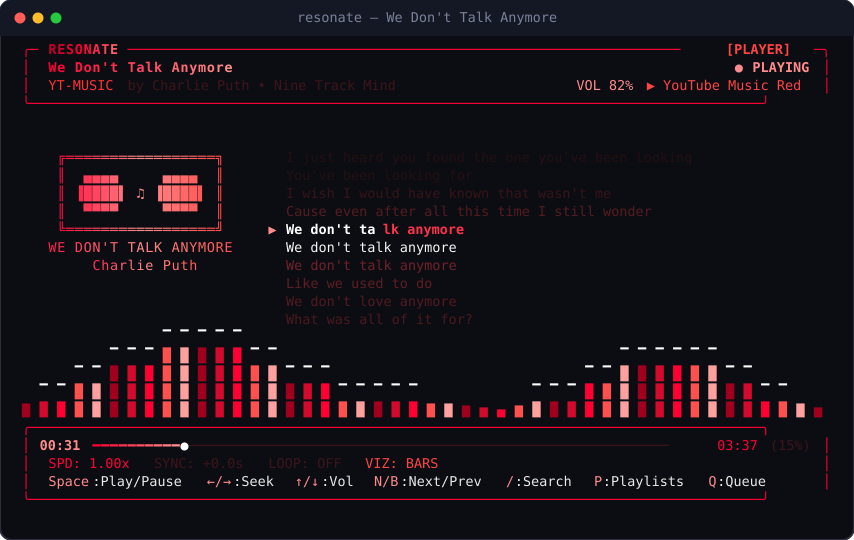

# Resonate

A high-performance terminal YouTube Music player featuring real-time synchronized lyrics, procedural audio visualizers, ANSI album art, and TrueColor themes.



---

## Features

- **Native Audio Streaming**: Direct high-bitrate audio streaming with instant offset seeking via FFmpeg / PipeWire / PulseAudio / ALSA.
- **Synchronized Karaoke Lyrics**: Sub-second accurate scrolling lyrics sourced from YouTube Music and LRCLIB with line and word-level progress tracking.
- **Procedural Visualizers**: Multi-mode procedural visualizers (Spectrum Bars, Oscilloscope Wave, Flame, Matrix Rain, Pulse, Vinyl).
- **TrueColor Terminal Themes**: Built-in themes (YouTube Music, Spotify, Cyberpunk, Tokyo Night, Sunset, Nord, Matrix, Synthwave, Sakura, Champagne Gold).
- **Dynamic Album Art**: Terminal ANSI half-block album art rendering with dominant color extraction.
- **Library & Exploration**: Browse playlists, liked tracks, trending charts, and live search autocomplete.
- **Zero-Dependency Single Binary**: Standalone compiled executables for Linux (x64/ARM64) and macOS (Intel/Apple Silicon).

---

## Installation

### 1-Line Quick Install (Linux & macOS)

```bash
curl -fsSL https://raw.githubusercontent.com/aman-senpai/resonate/master/install.sh | bash
```

The installer detects your operating system and CPU architecture, installs the standalone binary into `~/.local/bin/resonate`, and sets up required dependencies.

---

### Prerequisites

| Component | Purpose | Installation |
| :--- | :--- | :--- |
| **`ffmpeg` / `ffplay`** | Audio playback engine | **Fedora**: `sudo dnf install ffmpeg-free`<br>**Ubuntu/Debian**: `sudo apt install ffmpeg`<br>**Arch**: `sudo pacman -S ffmpeg`<br>**macOS**: `brew install ffmpeg` |
| **`yt-dlp`** | Stream extraction | Handled automatically by `install.sh` |

---

### Manual Install from Source

If you prefer building from source with Bun:

```bash
# Clone the repository
git clone https://github.com/aman-senpai/resonate.git
cd resonate

# Install dependencies and build
bun install
bun run build

# Run directly
bun run dev

# Or compile standalone binary
bun build --compile ./src/index.ts --outfile ~/.local/bin/resonate
```

---

## Usage

### Interactive Player Mode

Launch the terminal interface:

```bash
resonate
```

Search and immediately play a song:

```bash
resonate play "Queen - Bohemian Rhapsody"
resonate play "https://music.youtube.com/watch?v=fJ9rUzIMcZQ"
```

### CLI Subcommands

```bash
# Search tracks and playlists
resonate search "Radiohead"

# Browse personal library and liked songs
resonate library

# Browse top charts and explore categories
resonate charts

# Manage playlists
resonate playlist list
resonate playlist show <playlist-id>
resonate playlist play <playlist-id>

# Extract raw synchronized LRC lyrics to stdout
resonate get "Daft Punk - Get Lucky"

# YouTube Music Authentication (import browser cookies or OAuth)
resonate auth login --browser chrome
resonate auth status
resonate auth logout

# List all available TrueColor themes
resonate themes
```

---

## Controls

| Key | Action |
| :--- | :--- |
| <kbd>Space</kbd> | Play / Pause music & synchronized lyrics |
| <kbd>←</kbd> / <kbd>→</kbd> | Seek backward / forward 5s (<kbd>Shift</kbd> + <kbd>←</kbd>/<kbd>→</kbd> for 15s) |
| <kbd>↑</kbd> / <kbd>↓</kbd> | Volume up / down by 5% |
| <kbd>0</kbd> / <kbd>Home</kbd> | Restart track from beginning (0:00) |
| <kbd>N</kbd> / <kbd>B</kbd> | Next / Previous track in queue |
| <kbd>/</kbd> or <kbd>S</kbd> | Open live YouTube Music search |
| <kbd>P</kbd> or <kbd>L</kbd> | Open Playlists & Library modal |
| <kbd>Q</kbd> | Open Playback Queue modal (<kbd>D</kbd> to remove track) |
| <kbd>E</kbd> | Open Explore & Trending Charts modal |
| <kbd>R</kbd> or <kbd>M</kbd> | Toggle Full Reading lyrics mode (<kbd>PgUp</kbd>/<kbd>PgDn</kbd> to scroll) |
| <kbd>V</kbd> | Cycle audio visualizer mode |
| <kbd>T</kbd> / <kbd>Shift+T</kbd> | Cycle color theme forward / backward |
| <kbd>A</kbd> | Toggle Album Art display on / off |
| <kbd>I</kbd> | Toggle timestamps on lyrics lines on / off |
| <kbd>[</kbd> / <kbd>]</kbd> | Adjust audio / lyrics synchronization offset ($\pm$100ms) |
| <kbd>?</kbd> or <kbd>H</kbd> | Open in-app keyboard shortcuts help modal |
| <kbd>Esc</kbd> / <kbd>Ctrl+C</kbd> | Close active modal / Return / Exit |

---

## Project Structure

```
resonate/
├── .github/workflows/
│   └── release.yml          # Multi-architecture automated binary releases
├── assets/
│   └── screenshot.svg       # Terminal SVG UI preview
├── bin/
│   └── resonate.js          # CLI entry point launcher
├── src/
│   ├── engine/
│   │   ├── audioBackend.ts  # Native FFplay & fallback audio drivers
│   │   ├── player.ts        # Core high-precision playback clock
│   │   └── visualizer.ts    # Procedural audio visualizer algorithms
│   ├── parser/
│   │   └── lrc.ts           # Standard & enhanced LRC timestamp parser
│   ├── services/
│   │   ├── albumArt.ts      # ANSI TrueColor image rasterizer & color extractor
│   │   ├── auth.ts          # YouTube Music browser cookie and OAuth manager
│   │   ├── lyricsApi.ts     # Multi-source lyrics aggregator
│   │   └── ytmusic.ts       # Innertube & yt-dlp YouTube Music client
│   ├── ui/
│   │   ├── components/      # UI components (Header, Lyrics, ControlBar, Modals)
│   │   ├── renderer.ts      # 24-bit TrueColor ANSI screen buffer
│   │   └── themes.ts        # Built-in theme definitions & color palettes
│   ├── app.ts               # Terminal UI application coordinator
│   ├── cli.ts               # Command line argument parser & dispatcher
│   └── index.ts             # Module exports & main bootstrap
├── test/
│   └── lyrical.test.ts      # Automated unit & integration test suite
├── install.sh               # 1-line curl installer
├── package.json
└── tsconfig.json
```

---

## License

This project is licensed under the [MIT License](LICENSE).
