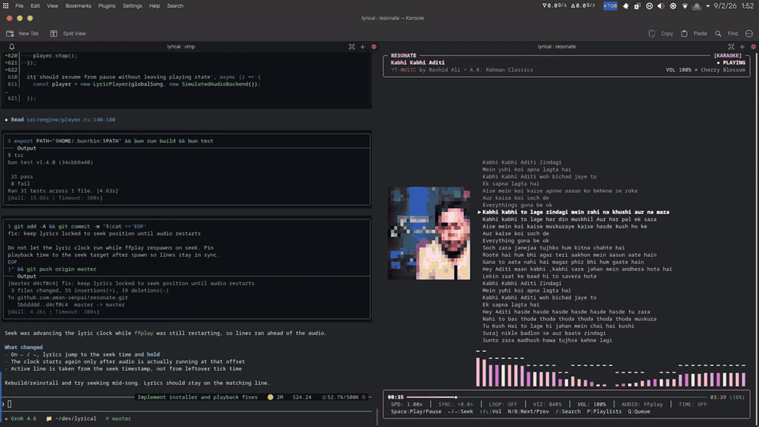

# Resonate

Terminal YouTube Music player. Synced lyrics, visualizers, album art.



## Install

Linux and macOS:

```bash
curl -fsSL https://raw.githubusercontent.com/aman-senpai/resonate/master/install.sh | bash
```

The script installs `resonate`, `yt-dlp`, and an audio engine (`ffplay` / `mpv` / `ffmpeg`). If `~/.local/bin` is new on your PATH, open a new terminal.

```bash
resonate
resonate "We Don't Talk Anymore"
```

Quote the title when it contains apostrophes (`don't`). Same thing: `resonate play "We Don't Talk Anymore"`.

## Commands

| | |
| :--- | :--- |
| `resonate` | Open the player |
| `resonate "<song>"` | Search and play (offline library first) |
| `resonate play <query\|url>` | Same as a quoted title |
| `resonate search [query]` | Search |
| `resonate library` | Liked songs |
| `resonate charts` | Trending |
| `resonate playlist list` | Playlists |
| `resonate downloads` | Offline library (list / clear / auto / limit) |
| `resonate auth login --browser chrome` | Sign in |
| `resonate themes` | List themes |

## Keys

| | |
| :--- | :--- |
| <kbd>Space</kbd> | Play / pause |
| <kbd>←</kbd> <kbd>→</kbd> | Seek 5s · <kbd>Shift</kbd> 15s |
| <kbd>↑</kbd> <kbd>↓</kbd> | Volume |
| <kbd>N</kbd> <kbd>B</kbd> | Next / previous |
| <kbd>O</kbd> | Toggle loop |
| <kbd>X</kbd> | Toggle shuffle |
| <kbd>U</kbd> | Mute / unmute |
| <kbd>,</kbd> <kbd>.</kbd> | Speed − / + 0.25x |
| <kbd>D</kbd> | Downloads |
| <kbd>/</kbd> | Search |
| <kbd>Q</kbd> | Queue |
| <kbd>V</kbd> | Visualizer |
| <kbd>T</kbd> | Theme |
| <kbd>?</kbd> | Help |

## License

[MIT](LICENSE)
